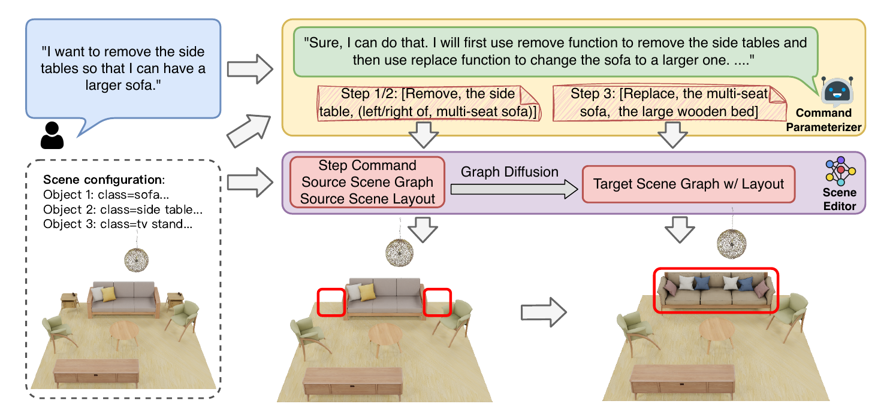

# EditRoom: LLM-parameterized Graph Diffusion for Composable 3D Room Layout Editing

Kaizhi Zheng, Xiaotong Chen, Xuehai He, Jing Gu, Linjie Li, Zhengyuan Yang, Kevin Lin, Jianfeng Wang, Lijuan Wang, Xin Eric Wang

[](https://arxiv.org/abs/2410.12836)
[](https://eric-ai-lab.github.io/edit-room.github.io/)
[](./LICENSE)

<p>
    
</p>

</h4>

This repository contains the official implementation of the paper: [EditRoom: LLM-parameterized Graph Diffusion for Composable 3D Room Layout Editing](https://arxiv.org/abs/2410.12836), which is accepted by ICLR 2025.
EditRoom is a graph diffusion-based generative model, which can manipulate 3D Room by using natural lanauge.

Feel free to contact me (kzheng31@ucsc.edu) or open an issue if you have any questions or suggestions.

## Getting Start

### 1. Installation
Clone our repo and create a new python environment.
```bash
git clone https://github.com/eric-ai-lab/EditRoom.git
cd EditRoom
conda create -n editroom python=3.10
conda activate editroom
pip install -r requirements.txt
```

Download the Blender software for visualization.
```bash
cd blender
wget https://download.blender.org/release/Blender3.3/blender-3.3.1-linux-x64.tar.xz
tar -xvf blender-3.3.1-linux-x64.tar.xz
rm blender-3.3.1-linux-x64.tar.xz
```

### 2. Creating Dataset

Dataset used in EditRoom is based on [3D-FORNT](https://tianchi.aliyun.com/specials/promotion/alibaba-3d-scene-dataset) and [3D-FUTURE](https://tianchi.aliyun.com/specials/promotion/alibaba-3d-future). Please refer to the instructions provided in their [official website](https://tianchi.aliyun.com/dataset/65347) to download the original dataset. Based on [InstructScene](https://huggingface.co/datasets/chenguolin/InstructScene_dataset), we write an automatic dataset generator to generate scene editing pairs. We provided preprocessed datasets on [HuggingFace](https://huggingface.co/datasets/KZ-ucsc/EditRoom_dataset/tree/main) for start.

First, downloading the preprocessed datasets. They will be downloaded under `datasets` folder by default. If you want to change to another directory, please remind to chage environment viariable `EDITROOM_DATA_FOLDER`.
```bash
export EDITROOM_DATA_FOLDER="./datasets"
python3 tools/download_dataset.py
```

Then, please refer to [tools/README.md](./tools/README.md) for more details.

### 3. Training

We will first train scene graph to scene layout generator:
```bash
python3 src/train_edit.py --config_file configs/bedroom_sg2sc_diffusion.yaml --output_directory ./weights --with_wandb_logger
```

Then, we will train scene graph generator:
```bash
python3 src/train_edit.py --config_file configs/bedroom_sg_diffusion.yaml --output_directory ./weights --with_wandb_logger
```

You can change `config_file` to other room types. All config files are under [configs](./configs/) folder.

### 4. Evaluation
To run the evaluation, we need both `SG_WEIGHT` and `SG2SC_WEIGHT`. Those weights should be found under `output_directory` for training.

If you runing on a headless server, please using `Xvfb` to create virtual screens for [pyrender](https://pyrender.readthedocs.io/en/latest/).
```bash
tmux new -s v_screen #Opening another terminal at the backend
sudo Xvfb :99 -screen 0 1960x1024x24
```

For evaluation, please run:
```bash
export DISPLAY=":99" #For headless server
python3 --sg_config_file configs/bedroom_sg_diffusion.yaml \
        --sg2sc_config_file configs/bedroom_sg2sc_diffusion.yaml \
        --output_directory ./weights \
        --sg_weight_file SG_WEIGHT \
        --sg2sc_weight_file SG2SC_WEIGHT \
        --llm_plan_path LLM_PLAN
```

`LLM_PLAN` should be created during dataset generation. Please refer to [tools/README.md](./tools/README.md) for more details.

You can also using tempalte commands for evaluation.
```bash
export DISPLAY=":99" #For headless server
python3 --sg_config_file configs/bedroom_sg_diffusion.yaml \
        --sg2sc_config_file configs/bedroom_sg2sc_diffusion.yaml \
        --output_directory ./weights \
        --sg_weight_file SG_WEIGHT \
        --sg2sc_weight_file SG2SC_WEIGHT
```


## Acknowledgement
We would like to thank the authors of [ATISS](https://github.com/nv-tlabs/ATISS), [DiffuScene](https://github.com/tangjiapeng/DiffuScene), [OpenShape](https://github.com/Colin97/OpenShape_code), [NAP](https://arxiv.org/abs/2305.16315), [CLIPLayout](https://arxiv.org/abs/2303.03565) and [InstructScene](https://arxiv.org/abs/2402.04717) for their great work and generously providing source codes, which inspired our work and helped us a lot in the implementation.


## Citation
If you find our work helpful, please consider citing:
```bibtex
@inproceedings{
zheng2025editroom,
title={EditRoom: {LLM}-parameterized Graph Diffusion for Composable 3D Room Layout Editing},
author={Kaizhi Zheng and Xiaotong Chen and Xuehai He and Jing Gu and Linjie Li and Zhengyuan Yang and Kevin Lin and Jianfeng Wang and Lijuan Wang and Xin Eric Wang},
booktitle={The Thirteenth International Conference on Learning Representations},
year={2025}
}
```
